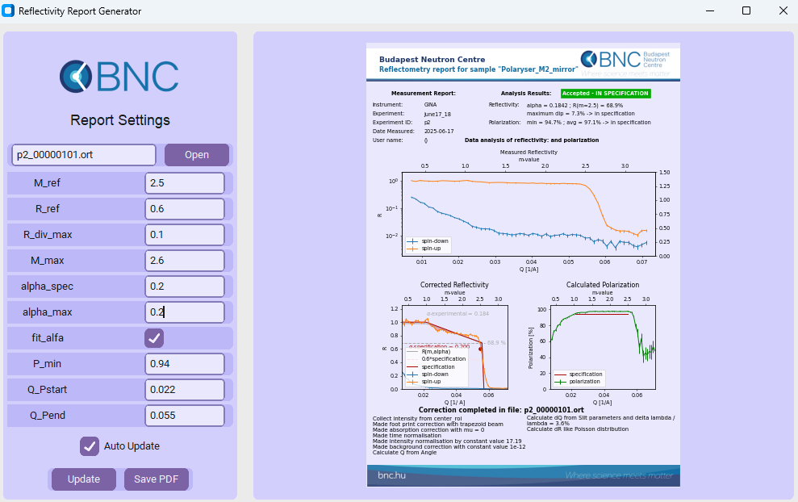

# GINja — Reflectometry Data Conversion and Reporting Tools

**GINja** is a Python-based CLI toolkit for converting raw reflectometry data from the **[GINA reflectometer](https://bnc.hu/gina/)** into standardized **[ORSO](https://www.reflectometry.org/)** format files, visualizing results, and preparing NOB ORSO type file.

---

## 📦 System Installation & Usage (Recommended)

To ensure all dependencies are correctly installed and to avoid conflicts with system packages (especially on Ubuntu/Debian), **using the setup script is recommended**. This method automatically creates a private virtual environment for the application.

### Installation

1.  Clone the repository:
    ```bash
    git clone https://github.com/igrikg/GINja.git
    cd GINja
    ```

2.  Install the package:

    **Option A: System-wide Install (Recommended)**
    This will create a private virtual environment in `/usr/local/share/GINja/venv` and link the tools to `/usr/local/bin`, making them available to all users.
    ```bash
    sudo python3 setup.py install
    ```
    
    **Option B: User Install**
    If you don't have sudo access, you can install for your user only. This creates the environment in `~/.local/share/GINja/venv`.
    ```bash
    python3 setup.py install
    ```

    **Desktop Shortcuts:**
    On Linux systems, the installation process will automatically attempt to create desktop shortcuts for the GUI tools in your application menu.

### Usage

Once installed, you can run the tools directly from your terminal:

*   **GUI Tools:**
    *   `ginja-converter`: Launches the Converter GUI.
    *   `ginja-report`: Launches the Report GUI.
    
    *(You can also find "GINja Converter" and "GINja Report" in your system's application menu)*

*   **CLI Tools:**
    *   `GINja_converter`: Command-line interface for conversion.
    *   `GINja_report`: Command-line interface for reporting.

---

## 🛠 Manual Usage (Without Installation)

If you prefer to run the scripts directly without installing the package, follow the instructions below.

## ✨ Features

- Convert GINA `.nxs` or `.dat` files to ORSO `.ort` format
- Apply detector, background, normalization, and reduction corrections
- Generate visual or PDF reflectivity reports
- Convert detector images to NOB-type ORSO files for PSI reporting

---

## 📦 Manual Installation

1. Clone this repository:
   ```bash
   git clone https://github.com/igrikg/GINja.git
   cd GINja
   ```
   
2. Create and activate a virtual environment:

   ```bash
   python -m venv .venv
   source .venv/bin/activate        # On Windows: .venv\Scripts\activate
   ```
   
3. Install the dependencies:

   ```bash
   pip install -r requirements.txt
   ```

---

##  🚀 Usage
###   🔁 converter.py — Convert raw scans to ORSO format
   ```bash
   python converter.py [-options] filename
   ```
   **Positional:**

   * `filename`: Input scan file (`.nxs` or `.dat`)

   **Key optional arguments:**
   * `-h`, `--help`: show help message and exit
   * `--outputName`: Output filename (default: `name_of_raw_file.ort`)
   * `--folder_of_input`: Folder where input file is located
   * `--folder_of_output_file`: Specific folder to save output file

   **Detector Settings:**
   * `--source_detector`
   * `--source_region`

   **Normalisation Settings:**
   * `--norm_time`: `{true,false}` 
   * `--norm_monitor`: `{true,false}`
   * `--norm_intensity_norm`: `{true,false}`
   * `--norm_intensity_norm_type`: `{constValue,maxValue,maxValueGlobal,psdRegion}`
   * `--norm_intensity_value`:
   * `--norm_intensity_point_number`:
   * `--norm_intensity_region`:

   **Reduction Settings:**
   * `--red_foot_print_correction`: `{true,false}`
   * `--red_absorption_correction`: `{true,false}`
   * `--red_polarisation_correction`: `{true,false}`
   * `--red_mu_type`: `{constValue,typical}`
   * `--red_mu_enum`: `{glass,Si,SiO2}`
   * `--red_mu_value`:
   
   **Background Settings:**
   * `--bg_use_correction`: `{true,false}`
   * `--bg_correction_type`: `{constValue,psdRegion,extraFile}`
   * `--bg_file`:
   * `--bg_value`:
   * `--bg_region`:

**Example:**
   ```bash
    python converter.py data.nxs \
      --norm_time true \
      --red_foot_print_correction false \
      --bg_use_correction true \
      --outputName sample.ort
   ```

### 🧾report.py — Generate reflectivity report (PDF or figure)
   ```bash
   python report.py input_file {show,make} [options]
   ```
 
   **Positional:**
   * `input_file`: Path to `.ort` file
   * `show`: Display interactive figure
   * `make`: Save report as PDF
   
   **Key options:**
   * `--output_file`: Output PDF filename
   * ` --M_ref`: location for reference reflectivity at high m
   * `--R_ref`:  reflectivity at reference location
   * `--R_div_max`: maximum deviation from theoretical curve
   * `--M_max`: m-value from specification (theoretical curve drop)
   * `--alpha_spec`: alpha for theoretical curve
   * `--alpha_max`: limit for measured alpha from specification
   * `--fit_alfa`:  evaluate alpha by fitting like `{true,false}`
   * `--P_min`: minimum polarization over Q-range
   * `--Q_Pstart`: start of Q-range evaluation
   * `--Q_Pend`: end of Q-range evaluation
   * `-h`, `--help`: show help message and exit

      **Example:**
      ```bash
      python report.py sample.ort make --output_file report.pdf --fit_alfa true
      ```
### 📸 nob_type_converter.py — Convert detector image to NOB-type ORSO file
   ```bash
   python nob_type_converter.py filename detector [--region y1 y2 x1 x2]
   ```
   **Positional:**
   * `filename`: Input `.dat` or `.nxs` file 
   * `detector`: Name of detector or ROI 

   **Optional:**
   * `--region`: Specify ROI region: `y1 y2 x1 x2`
   * `-h`, `--help`: show help message and exit

   **Example:**
   ```bash
   python nob_type_converter.py detector.npy rear_detector --region 100 200 50 150
   ```

---

## 🖼 GUI Report Tool

This GUI provides an interactive interface to configure reflectometry report parameters, preview the result, and export to PDF. It is built with `customtkinter` and integrates Matplotlib for visual feedback.

### ✨ Features

- Left sidebar with editable parameters (`M_ref`, `R_ref`, `alpha_spec`, etc.)
- File selection and display of input file name
- Optional auto-update of plot when any parameter is changed
- Buttons to update or export the report PDF
- Live preview of the generated report using Matplotlib (A4 portrait ratio)
- Placeholder report view with message when no input data is available
- Auto-save of report settings on app exit

---
### 🖼 Screenshot Placeholder



---

### 💾 Auto-Saving

On exit, the app automatically saves the last used configuration to `config_report.json`. When launched again, the app can optionally preload that configuration.

---

## 📁 Project Structure
   ``` bash
   GINja/
   ├── converter/                # Main converter to ORSO package
   ├── generator/                # Reflectivity figure/PDF generator package
   ├── convert_to_narziss/       # NOB-type file converter package 
   ├── requirements.txt
   ├── converter.py              # Main converter to ORSO
   ├── report.py                 # Reflectivity figure/PDF generator
   ├── reportGUI.py              # GUI version of reflectivity figure/PDF generator
   ├── nob_type_converter.py     # Converts 2D detector data to NOB-type file
   ├── README.md
   └── .venv/                    # Local virtual environment (not committed)
   ```

---

## 🧪 Sample Workflow
```bash
   # Step 1: Convert to ORSO
   python converter.py raw_data.nxs --outputName sample.ort

   # Step 2: Show report
   python report.py sample.ort show

   # Step 3: Create PDF report
   python report.py sample.ort make --output_file report.pdf
```

---
 
## 📋 Requirements
    
* Python 3.10+
* `numpy`
* `pandas`
* `nexusformat`
* `orsopy`
* `scipy`
* `matplotlib`

**Install all dependencies with:**
```bash
    pip install -r requirements.txt
```

---

## 📄 License
This project is licensed under the [MIT License](https://rem.mit-license.org/).

Feel free to use, modify, and share with attribution.

---


## 🙏 Acknowledgements

We gratefully acknowledge the team responsible for the **[GINA reflectometer](https://bnc.hu/gina/)** at the Budapest Neutron Centre ([BNC](https://bnc.hu/)) for their invaluable contributions.

Special thanks to the developers of the **[Nicos](https://nicos-controls.org/)** control system, whose efforts have significantly enhanced our operational capabilities.

We recognize the use of **[ORSO](https://www.reflectometry.org/)** as the standard output format for reflectometry data.

Additionally, we acknowledge the developer of the PSI NOB-type converter, created to fulfill specific institutional reporting needs.

---

## 🙋 Feedback & Contributions

Have feedback or want to contribute?  
Open [an issue](https://github.com/igrikg/GINja/issues) or submit a pull request!